# 🚀 C++ Fundamental Algorithms


A curated collection of **fundamental algorithms and data structures implemented in C++**.
This repository is designed for learning, practicing, and mastering core concepts in computer science.

---

## 📌 Features

* ✅ Clean and well-structured C++ implementations
* ✅ Beginner → Intermediate level algorithms
* ✅ Useful for **competitive programming** and **technical interviews**
* ✅ Easy-to-understand code with comments

---

## 📂 Project Structure

```
cpp-fundamental-algorithms/
├── minmax/
│   ├── min.cpp
│   └── max.cpp
│
├── basic-arithmetic/
│   ├── addition.cpp
│   ├── subtraction.cpp
│   ├── multiplication.cpp
│   └── division.cpp
│
├── digits-of-a-number/
│   ├── count_digits.cpp
│   ├── print_digits.cpp
│   ├── reverse-number.cpp
│   ├── sum_digits.cpp
│   ├── palindrome-number.cpp
│   └── control-digit.cpp
│
├── divisibility/
│   ├── divisibility-check.cpp
│   ├── divisible_by_2.cpp
│   ├── divisible_by_3.cpp
│   ├── divisible_by_5.cpp
│   ├── divisible-by-10.cpp
│   ├── divisible-by-9.cpp
│   ├── count-divisible-numbers.cpp
│   ├── filter-divisible-numbers.cpp
│   ├── is_prime.cpp
│   ├── nth_fibonacci.cpp
│   ├── prime_factorization.cpp
│   ├── gcd-lcm/
│   │   ├── gcd_euclid.cpp
│   │   ├── gcd_subtraction.cpp
│   │   └── lcm.cpp
│   └── divisors/
│       ├── brute-force.cpp
│       └── efficient.cpp
│
├── instructions/
│   ├── if_else.cpp
│   ├── for_loop.cpp
│   ├── while_loop.cpp
│   ├── do_while.cpp
│   ├── break.cpp
│   └── continue.cpp
│
└── README.md
```

---

## ⚙️ How to Use

### 🔹 Compile

```bash
g++ file.cpp -o output
```

### 🔹 Run

```bash
./output
```

---

## 🧠 Topics Covered

* Basic Arithmetic
* Digits of a Number
* Min / Max Element
* Divisibility Rules
* Prime Numbers & Factorization
* GCD & LCM
* Divisors
* Fibonacci Sequence
* Control Flow Instructions

---

## 📐 Schematized Algorithms

### 1. Min & Max Element

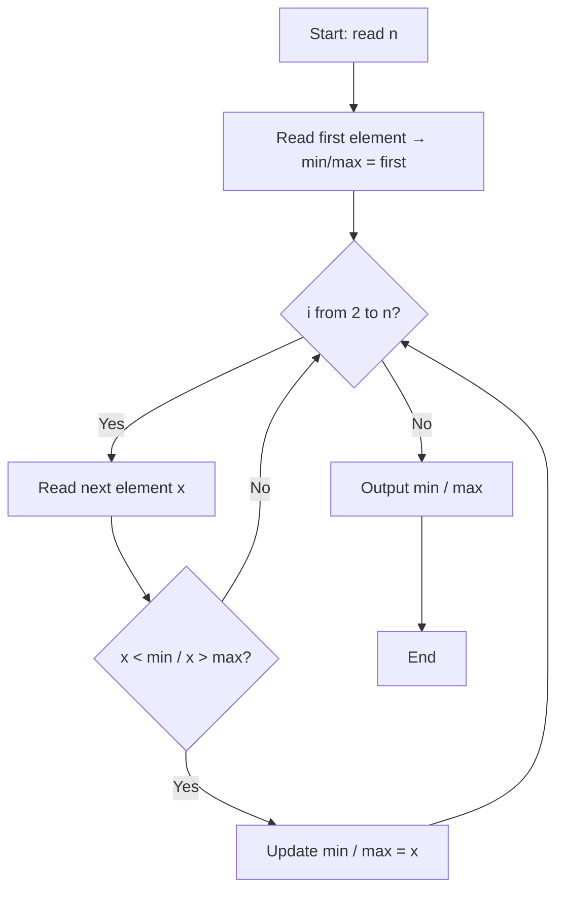
```mermaid
flowchart TD
    A["Start: read n"] --> B["Read first element → min/max = first"]
    B --> C{"i from 2 to n?"}
    C -->|"Yes"| D["Read next element x"]
    D --> E{"x < min / x > max?"}
    E -->|"Yes"| F["Update min / max = x"]
    E -->|"No"| C
    F --> C
    C -->|"No"| G["Output min / max"]
    G --> H["End"]
```

---

### 2. Count Digits

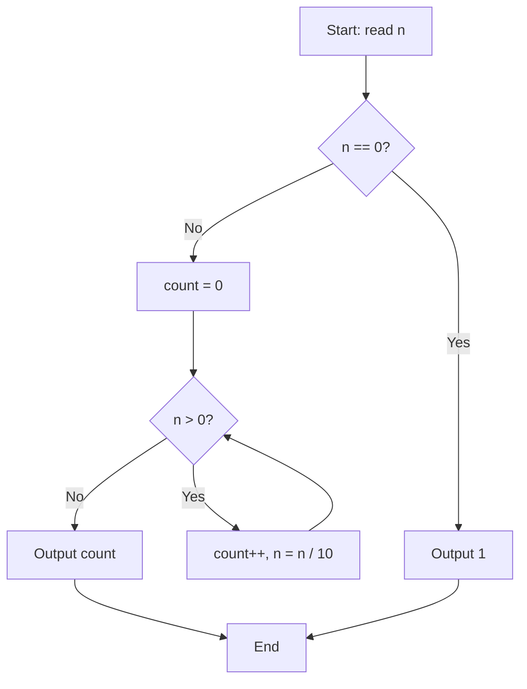
```mermaid
flowchart TD
    A["Start: read n"] --> B{"n == 0?"}
    B -->|"Yes"| C["Output 1"]
    B -->|"No"| D["count = 0"]
    D --> E{"n > 0?"}
    E -->|"Yes"| F["count++, n = n / 10"]
    F --> E
    E -->|"No"| G["Output count"]
    G --> H["End"]
    C --> H
```

---

### 3. Reverse a Number

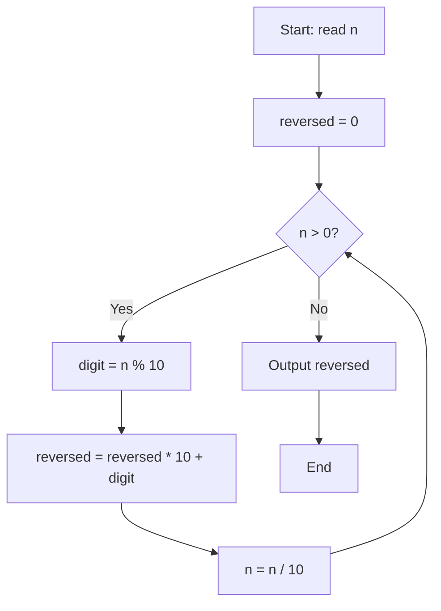
```mermaid
flowchart TD
    A["Start: read n"] --> B["reversed = 0"]
    B --> C{"n > 0?"}
    C -->|"Yes"| D["digit = n % 10"]
    D --> E["reversed = reversed * 10 + digit"]
    E --> F["n = n / 10"]
    F --> C
    C -->|"No"| G["Output reversed"]
    G --> H["End"]
```

---

### 4. Palindrome Number

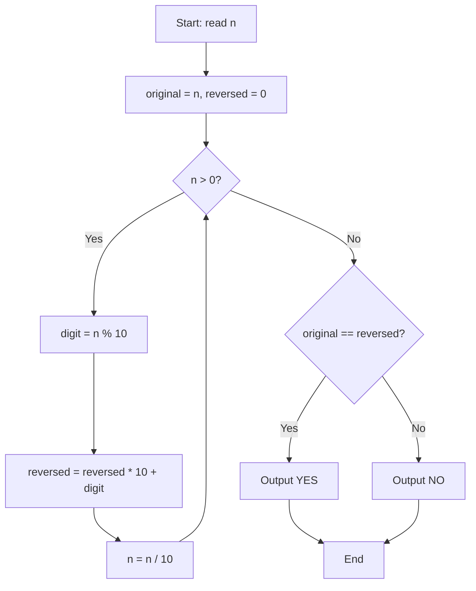
```mermaid
flowchart TD
    A["Start: read n"] --> B["original = n, reversed = 0"]
    B --> C{"n > 0?"}
    C -->|"Yes"| D["digit = n % 10"]
    D --> E["reversed = reversed * 10 + digit"]
    E --> F["n = n / 10"]
    F --> C
    C -->|"No"| G{"original == reversed?"}
    G -->|"Yes"| H["Output YES"]
    G -->|"No"| I["Output NO"]
    H --> J["End"]
    I --> J
```

---

### 5. Control Digit (Digital Root)

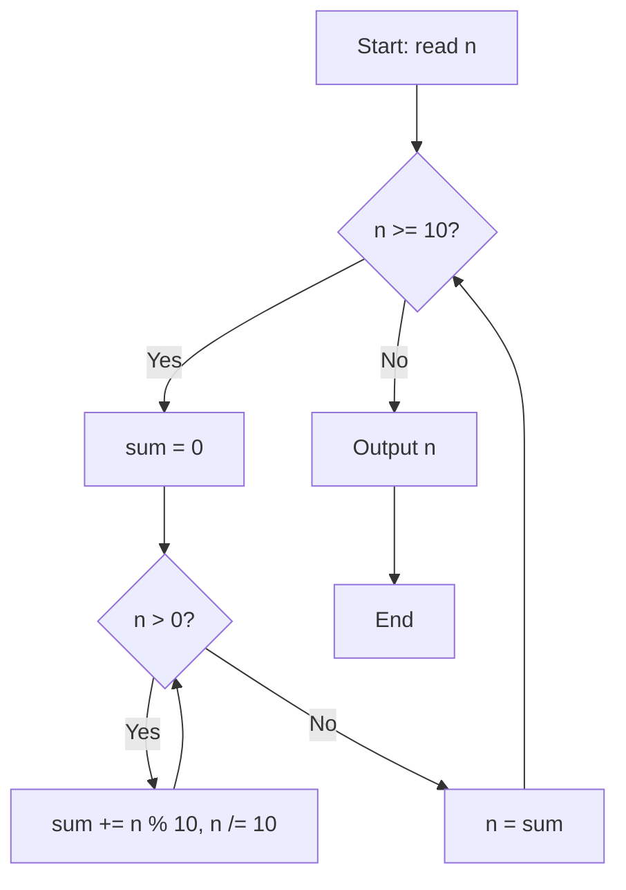
```mermaid
flowchart TD
    A["Start: read n"] --> B{"n >= 10?"}
    B -->|"Yes"| C["sum = 0"]
    C --> D{"n > 0?"}
    D -->|"Yes"| E["sum += n % 10, n /= 10"]
    E --> D
    D -->|"No"| F["n = sum"]
    F --> B
    B -->|"No"| G["Output n"]
    G --> H["End"]
```

---

### 6. Sum of Digits

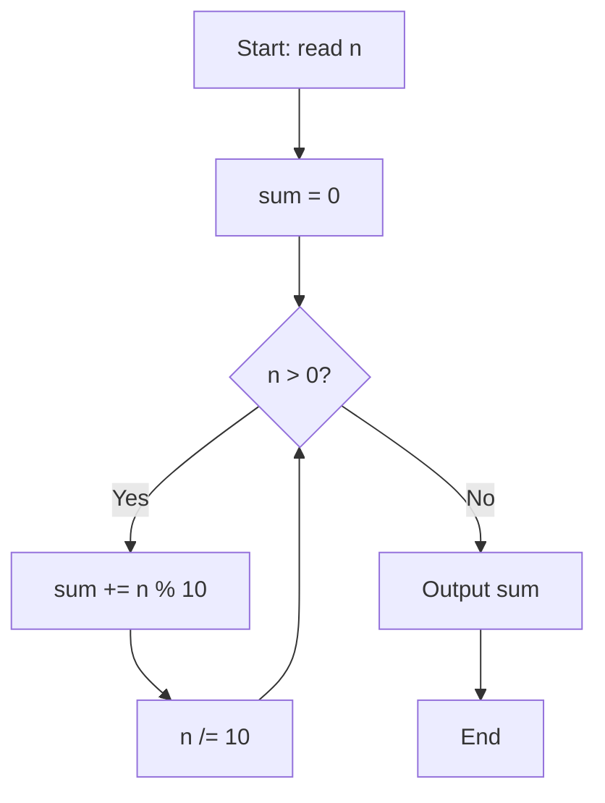
```mermaid
flowchart TD
    A["Start: read n"] --> B["sum = 0"]
    B --> C{"n > 0?"}
    C -->|"Yes"| D["sum += n % 10"]
    D --> E["n /= 10"]
    E --> C
    C -->|"No"| F["Output sum"]
    F --> G["End"]
```

---

### 7. Divisibility Check (generic)

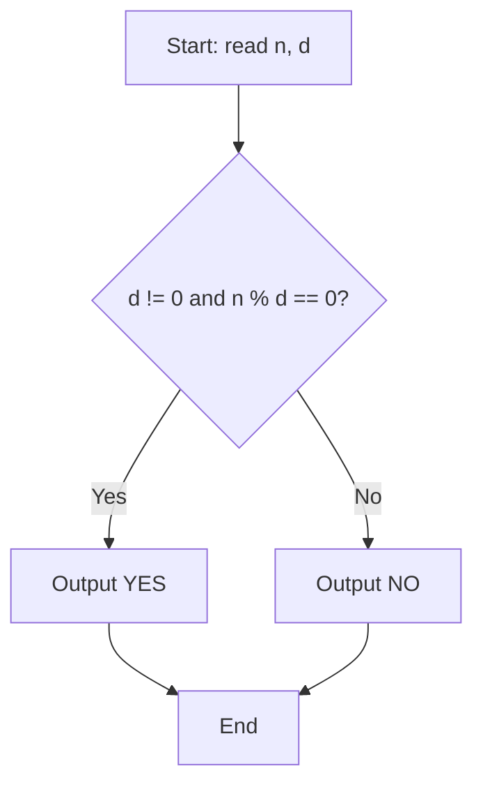
```mermaid
flowchart TD
    A["Start: read n, d"] --> B{"d != 0 and n % d == 0?"}
    B -->|"Yes"| C["Output YES"]
    B -->|"No"| D["Output NO"]
    C --> E["End"]
    D --> E
```

---

### 8. Prime Check (Optimized O(sqrt(n)))

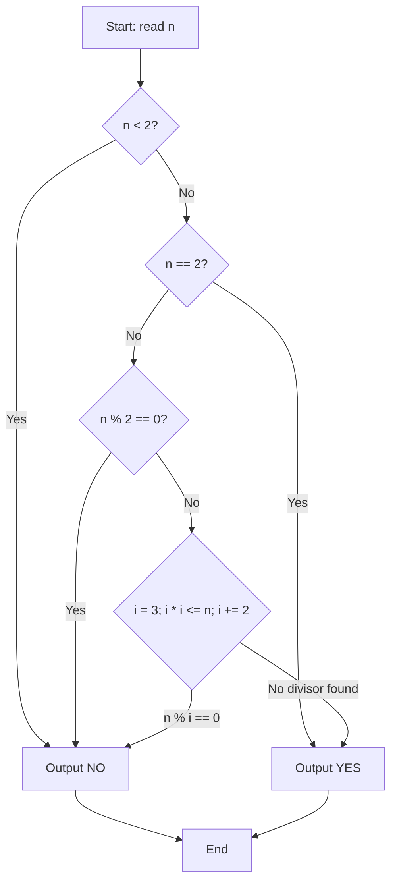
```mermaid
flowchart TD
    A["Start: read n"] --> B{"n < 2?"}
    B -->|"Yes"| C["Output NO"]
    B -->|"No"| D{"n == 2?"}
    D -->|"Yes"| E["Output YES"]
    D -->|"No"| F{"n % 2 == 0?"}
    F -->|"Yes"| C
    F -->|"No"| G{"i = 3; i * i <= n; i += 2"}
    G -->|"n % i == 0"| C
    G -->|"No divisor found"| E
    C --> H["End"]
    E --> H
```

---

### 9. Nth Fibonacci

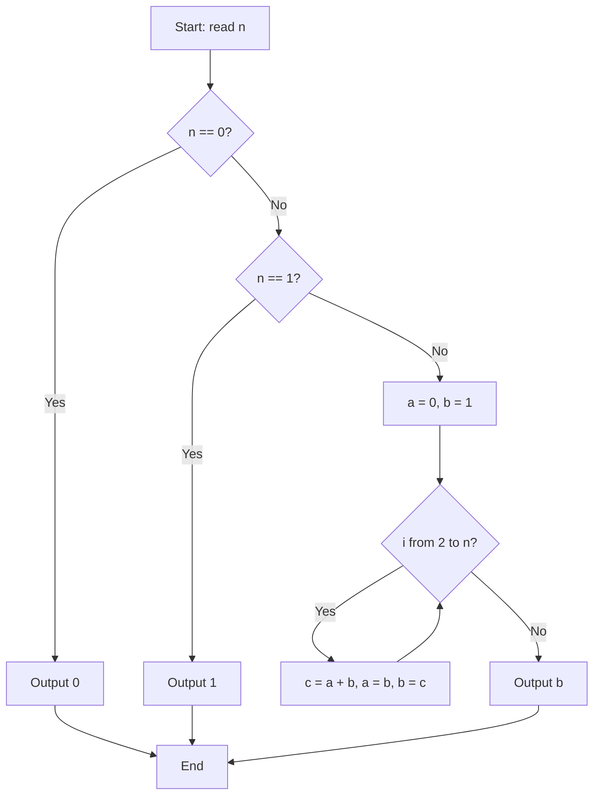
```mermaid
flowchart TD
    A["Start: read n"] --> B{"n == 0?"}
    B -->|"Yes"| C["Output 0"]
    B -->|"No"| D{"n == 1?"}
    D -->|"Yes"| E["Output 1"]
    D -->|"No"| F["a = 0, b = 1"]
    F --> G{"i from 2 to n?"}
    G -->|"Yes"| H["c = a + b, a = b, b = c"]
    H --> G
    G -->|"No"| I["Output b"]
    C --> J["End"]
    E --> J
    I --> J
```

---

### 10. GCD - Euclid's Algorithm

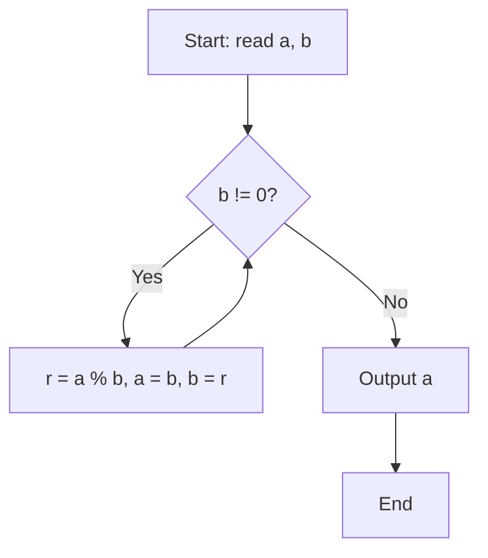
```mermaid
flowchart TD
    A["Start: read a, b"] --> B{"b != 0?"}
    B -->|"Yes"| C["r = a % b, a = b, b = r"]
    C --> B
    B -->|"No"| D["Output a"]
    D --> E["End"]
```

---

### 11. GCD - Subtraction Method

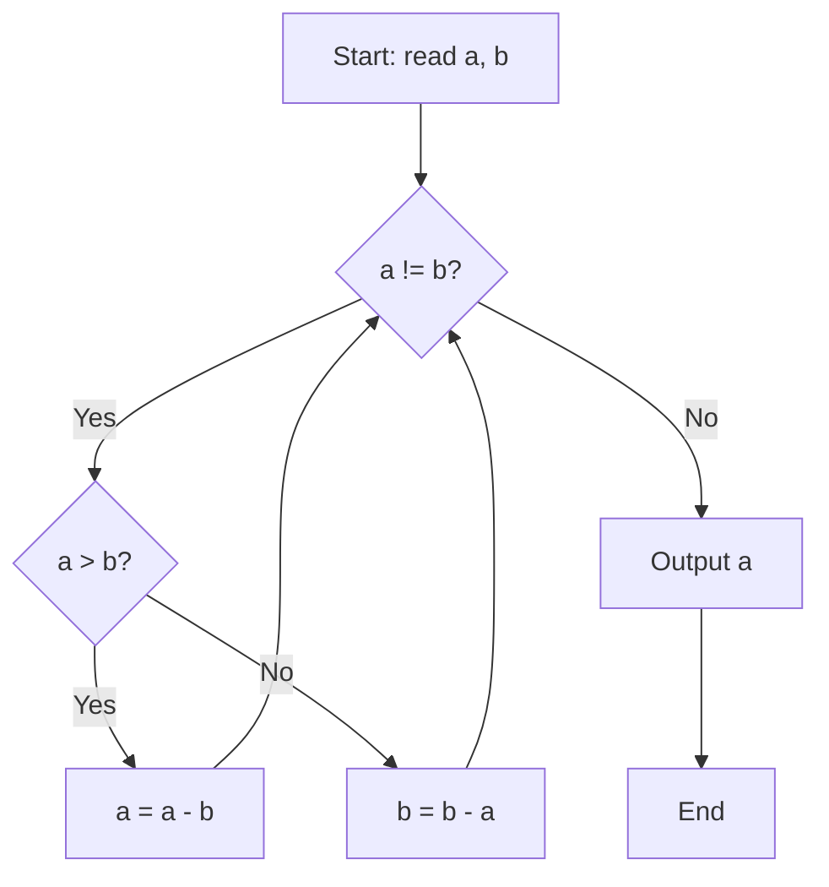
```mermaid
flowchart TD
    A["Start: read a, b"] --> B{"a != b?"}
    B -->|"Yes"| C{"a > b?"}
    C -->|"Yes"| D["a = a - b"]
    C -->|"No"| E["b = b - a"]
    D --> B
    E --> B
    B -->|"No"| F["Output a"]
    F --> G["End"]
```

---

### 12. LCM

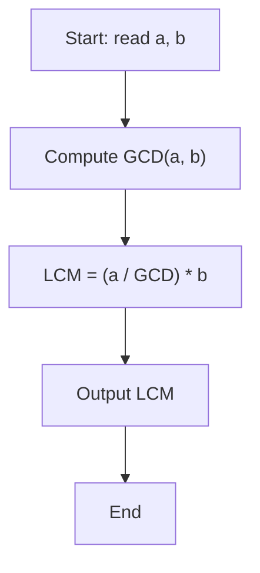
```mermaid
flowchart TD
    A["Start: read a, b"] --> B["Compute GCD(a, b)"]
    B --> C["LCM = (a / GCD) * b"]
    C --> D["Output LCM"]
    D --> E["End"]
```

---

### 13. Divisors - Efficient O(sqrt(n))

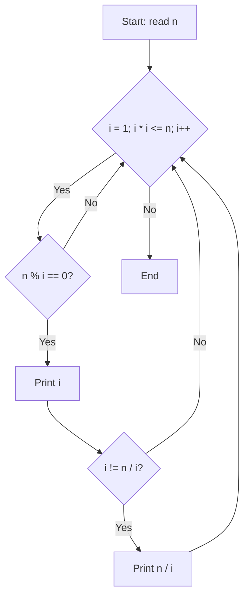
```mermaid
flowchart TD
    A["Start: read n"] --> B{"i = 1; i * i <= n; i++"}
    B -->|"Yes"| C{"n % i == 0?"}
    C -->|"Yes"| D["Print i"]
    D --> E{"i != n / i?"}
    E -->|"Yes"| F["Print n / i"]
    E -->|"No"| B
    F --> B
    C -->|"No"| B
    B -->|"No"| G["End"]
```

---

### 14. Prime Factorization

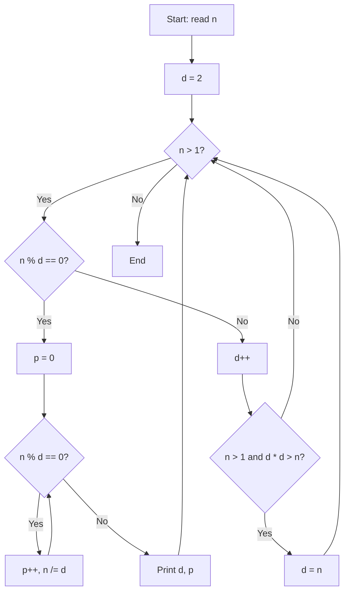
```mermaid
flowchart TD
    A["Start: read n"] --> B["d = 2"]
    B --> C{"n > 1?"}
    C -->|"Yes"| D{"n % d == 0?"}
    D -->|"Yes"| E["p = 0"]
    E --> F{"n % d == 0?"}
    F -->|"Yes"| G["p++, n /= d"]
    G --> F
    F -->|"No"| H["Print d, p"]
    D -->|"No"| I["d++"]
    I --> J{"n > 1 and d * d > n?"}
    J -->|"Yes"| K["d = n"]
    J -->|"No"| C
    H --> C
    K --> C
    C -->|"No"| L["End"]
```

---

### 15. Count / Filter Divisible Numbers

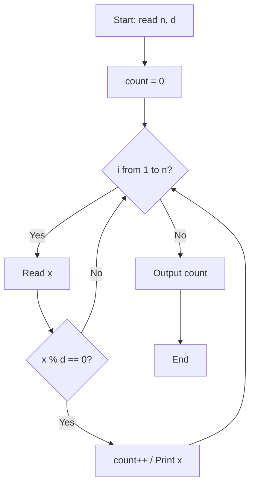
```mermaid
flowchart TD
    A["Start: read n, d"] --> B["count = 0"]
    B --> C{"i from 1 to n?"}
    C -->|"Yes"| D["Read x"]
    D --> E{"x % d == 0?"}
    E -->|"Yes"| F["count++ / Print x"]
    E -->|"No"| C
    F --> C
    C -->|"No"| G["Output count"]
    G --> H["End"]
```

---

### 16. For Loop

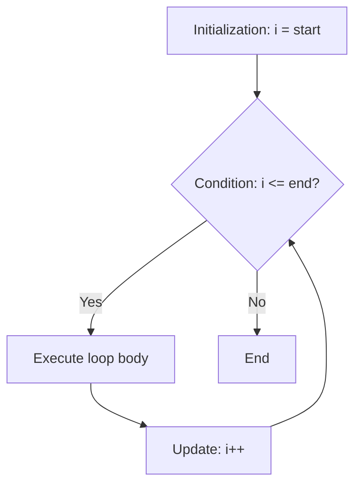
```mermaid
flowchart TD
    A["Initialization: i = start"] --> B{"Condition: i <= end?"}
    B -->|"Yes"| C["Execute loop body"]
    C --> D["Update: i++"]
    D --> B
    B -->|"No"| E["End"]
```

---

### 17. While Loop

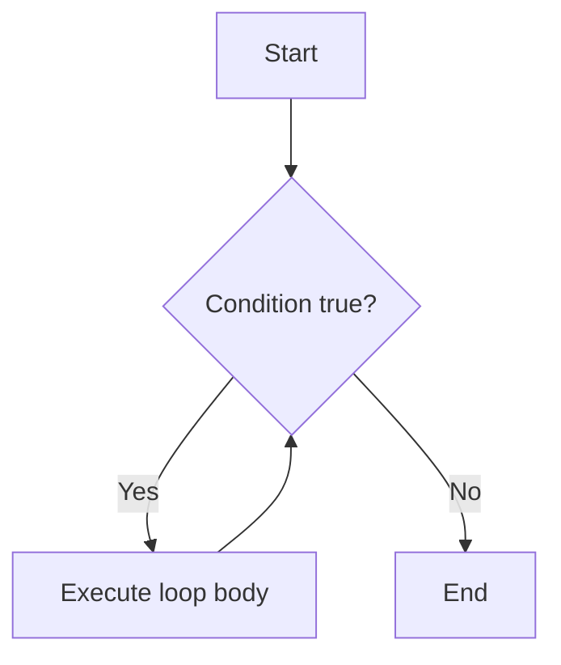
```mermaid
flowchart TD
    A["Start"] --> B{"Condition true?"}
    B -->|"Yes"| C["Execute loop body"]
    C --> B
    B -->|"No"| D["End"]
```

---

### 18. Do-While Loop

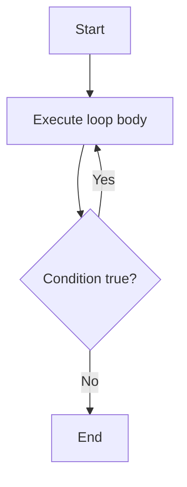
```mermaid
flowchart TD
    A["Start"] --> B["Execute loop body"]
    B --> C{"Condition true?"}
    C -->|"Yes"| B
    C -->|"No"| D["End"]
```

---

### 19. Break Statement

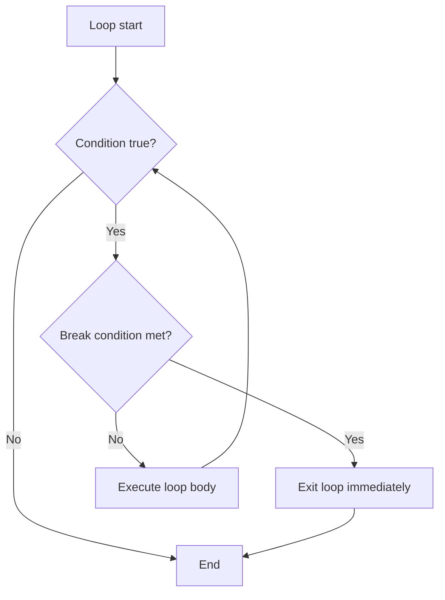
```mermaid
flowchart TD
    A["Loop start"] --> B{"Condition true?"}
    B -->|"Yes"| C{"Break condition met?"}
    C -->|"Yes"| D["Exit loop immediately"]
    C -->|"No"| E["Execute loop body"]
    E --> B
    B -->|"No"| F["End"]
    D --> F
```

---

### 20. Continue Statement

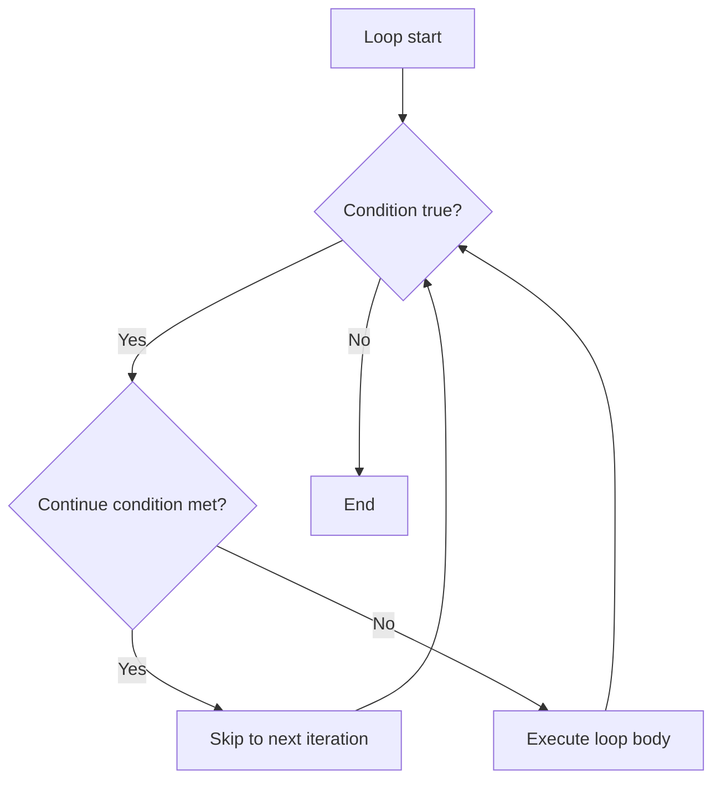
```mermaid
flowchart TD
    A["Loop start"] --> B{"Condition true?"}
    B -->|"Yes"| C{"Continue condition met?"}
    C -->|"Yes"| D["Skip to next iteration"]
    C -->|"No"| E["Execute loop body"]
    E --> B
    B -->|"No"| F["End"]
    D --> B
```

---

### 21. If / Else Structure

```mermaid
flowchart TD
    A["Start"] --> B{"Condition?"}
    B -->|"True"| C["Execute IF block"]
    B -->|"False"| D{"Else condition?"}
    D -->|"True"| E["Execute ELSE IF block"]
    D -->|"False"| F["Execute ELSE block"]
    C --> G["End"]
    E --> G
    F --> G
```

---

## 🎯 Goals

* Build a strong foundation in algorithms
* Prepare for contests (e.g. competitive programming)
* Improve problem-solving skills
* Create a solid GitHub portfolio

---

## 🤝 Contributing

Contributions are welcome!

1. Fork the repository
2. Create a new branch (`feature-new-algo`)
3. Commit your changes
4. Open a Pull Request

---

## 📜 License

This project is licensed under the **MIT License**.

---

## 👨‍💻 Author

**Aurel Ionita**

* GitHub: https://github.com/itsiamdev

---

## ⭐ Support

If you find this repository useful, consider giving it a **star ⭐**!
