# 🚀 C++ Fundamental Algorithms


A curated collection of **fundamental algorithms and data structures implemented in C++**.
This repository is designed for learning, practicing, and mastering core concepts in computer science.

---

## 📌 Features

* ✅ Clean and well-structured C++ implementations
* ✅ Beginner → Intermediate level algorithms
* ✅ Useful for **competitive programming** and **technical interviews**
* ✅ Easy-to-understand code with comments

---

## 📂 Project Structure

```
cpp-fundamental-algorithms/
├── minmax/
│   ├── min.cpp
│   └── max.cpp
│
├── basic-arithmetic/
│   ├── addition.cpp
│   ├── subtraction.cpp
│   ├── multiplication.cpp
│   └── division.cpp
│
├── digits-of-a-number/
│   ├── count_digits.cpp
│   ├── print_digits.cpp
│   ├── reverse-number.cpp
│   ├── sum_digits.cpp
│   ├── palindrome-number.cpp
│   └── control-digit.cpp
│
├── divisibility/
│   ├── divisibility-check.cpp
│   ├── divisible_by_2.cpp
│   ├── divisible_by_3.cpp
│   ├── divisible_by_5.cpp
│   ├── divisible-by-10.cpp
│   ├── divisible-by-9.cpp
│   ├── count-divisible-numbers.cpp
│   ├── filter-divisible-numbers.cpp
│   ├── is_prime.cpp
│   ├── nth_fibonacci.cpp
│   ├── prime_factorization.cpp
│   ├── gcd-lcm/
│   │   ├── gcd_euclid.cpp
│   │   ├── gcd_subtraction.cpp
│   │   └── lcm.cpp
│   └── divisors/
│       ├── brute-force.cpp
│       └── efficient.cpp
│
├── instructions/
│   ├── if_else.cpp
│   ├── for_loop.cpp
│   ├── while_loop.cpp
│   ├── do_while.cpp
│   ├── break.cpp
│   └── continue.cpp
│
├── subprograme/
│   ├── function_anatomy.cpp
│   ├── function_definition_declaration.cpp
│   ├── variable_declaration.cpp
│   ├── parameter_passing.cpp
│   ├── call_stack.cpp
│   └── more_about_functions.cpp
│
├── recursion/
│   ├── recursive_count_digits.cpp
│   ├── recursive_sum_digits.cpp
│   ├── recursive_print_digits.cpp
│   ├── recursive_reverse_number.cpp
│   ├── recursive_palindrome.cpp
│   └── flood_fill.cpp
│
├── divide-et-impera/
│   ├── merge_sort.cpp
│   └── quick_sort.cpp
│
├── strings/
│   ├── ascii_code.cpp
│   ├── cpp_strings.cpp
│   └── escape_sequences.cpp
│
├── heterogeneous-data/
│   ├── structs_basics.cpp
│   ├── array_of_structs.cpp
│   └── unions.cpp
│
├── linear-data-structures/
│   ├── stack.cpp
│   └── queue.cpp
│
├── linked-lists/
│   ├── singly_linked_list.cpp
│   └── doubly_linked_list.cpp
│
├── combinatorics/
│   └── basics.cpp
│
├── algorithm-analysis/
│   └── complexity_basics.cpp
│
├── geometry/
│   └── basics.cpp
│
├── miscellaneous/
│   └── problems.cpp
│
├── backtracking/
│   ├── subsets_backtracking.cpp
│   ├── permutations_backtracking.cpp
│   ├── combinations_backtracking.cpp
│   ├── grid_paths.cpp
│   └── n_queens.cpp
│
├── greedy/
│   ├── coin_change.cpp
│   ├── activity_selection.cpp
│   └── fractional_knapsack.cpp
│
└── README.md
  ```

---

## ⚙️ How to Use

### 🔹 Compile

```bash
g++ file.cpp -o output
```

### 🔹 Run

```bash
./output
```

---

## 🧠 Topics Covered

* Basic Arithmetic
* Digits of a Number
* Min / Max Element
* Divisibility Rules
* Prime Numbers & Factorization
* GCD & LCM
* Divisors
* Fibonacci Sequence
* Control Flow Instructions
* Subprograms (Functions)
* Recursion (Recursive Digit Processing & Flood Fill)
* Divide et Impera (Merge Sort & Quick Sort)
* Strings (ASCII Codes, C++ Strings & Escape Sequences)
* Heterogeneous Data Structures (Structs, Arrays of Structs, Unions)
* Linear Data Structures (Stack & Queue)
* Dynamically Allocated Linked Lists (Singly & Doubly Linked Lists)
* Combinatorics (Permutations & Combinations)
* Algorithm Efficiency Analysis (Time Complexity)
* Geometry Basics (Distance, Area, Perimeter)
* Miscellaneous Problems (Vowels, Matrix max, Rotation)
* Backtracking (Subsets, Permutations, Combinations, Grid Paths, N-Queens)
* Greedy Method (Coin Change, Activity Selection, Fractional Knapsack)

---

## 📐 Schematized Algorithms

### 1. Min & Max Element

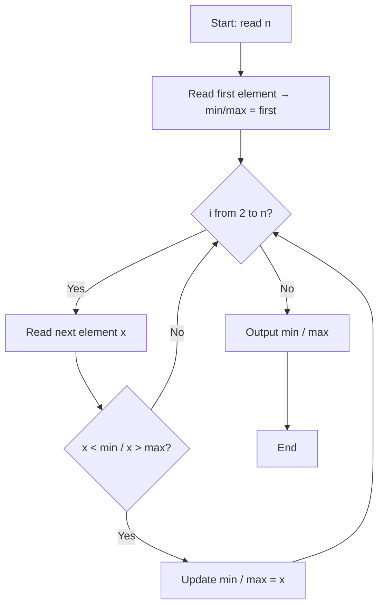
```mermaid
flowchart TD
    A["Start: read n"] --> B["Read first element → min/max = first"]
    B --> C{"i from 2 to n?"}
    C -->|"Yes"| D["Read next element x"]
    D --> E{"x < min / x > max?"}
    E -->|"Yes"| F["Update min / max = x"]
    E -->|"No"| C
    F --> C
    C -->|"No"| G["Output min / max"]
    G --> H["End"]
```

---

### 2. Count Digits

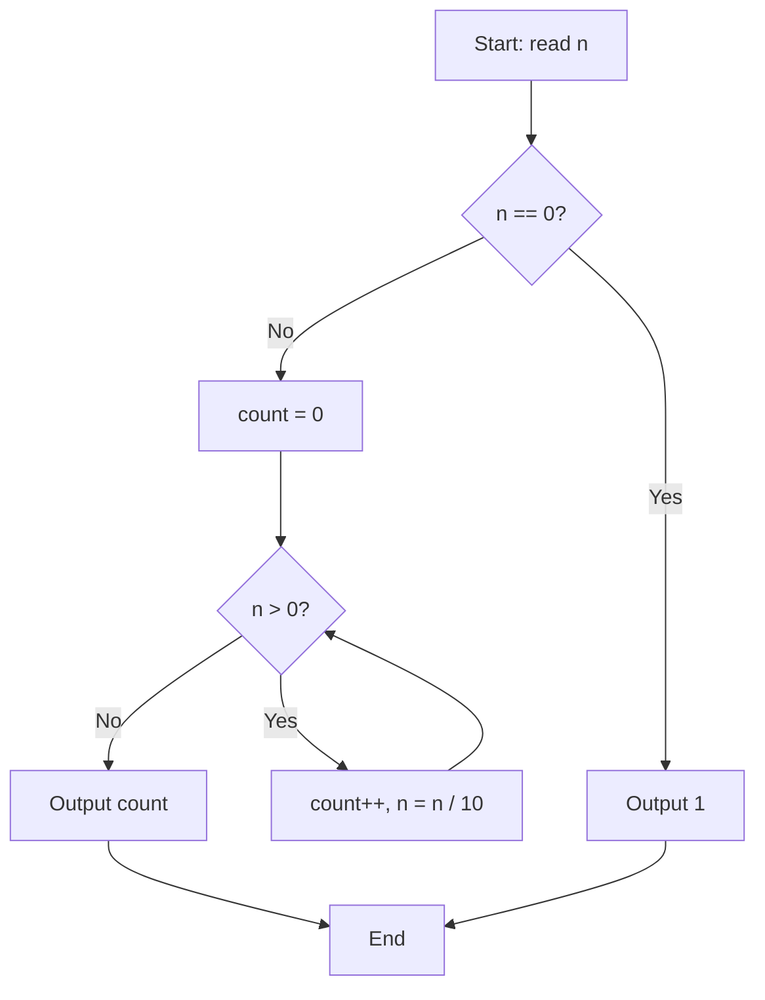
```mermaid
flowchart TD
    A["Start: read n"] --> B{"n == 0?"}
    B -->|"Yes"| C["Output 1"]
    B -->|"No"| D["count = 0"]
    D --> E{"n > 0?"}
    E -->|"Yes"| F["count++, n = n / 10"]
    F --> E
    E -->|"No"| G["Output count"]
    G --> H["End"]
    C --> H
```

---

### 3. Reverse a Number

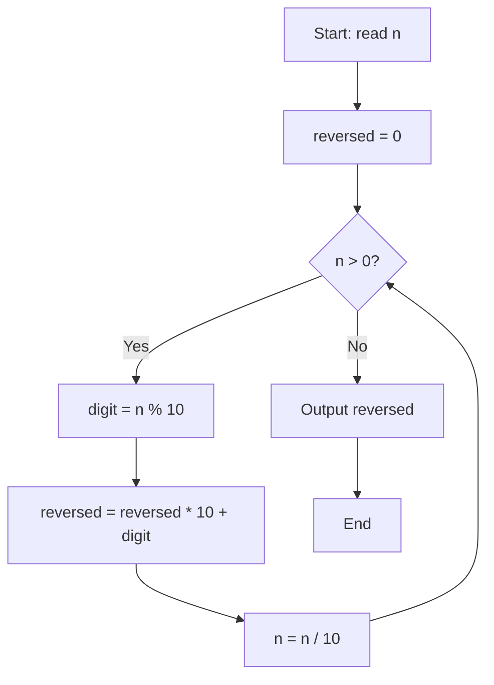
```mermaid
flowchart TD
    A["Start: read n"] --> B["reversed = 0"]
    B --> C{"n > 0?"}
    C -->|"Yes"| D["digit = n % 10"]
    D --> E["reversed = reversed * 10 + digit"]
    E --> F["n = n / 10"]
    F --> C
    C -->|"No"| G["Output reversed"]
    G --> H["End"]
```

---

### 4. Palindrome Number

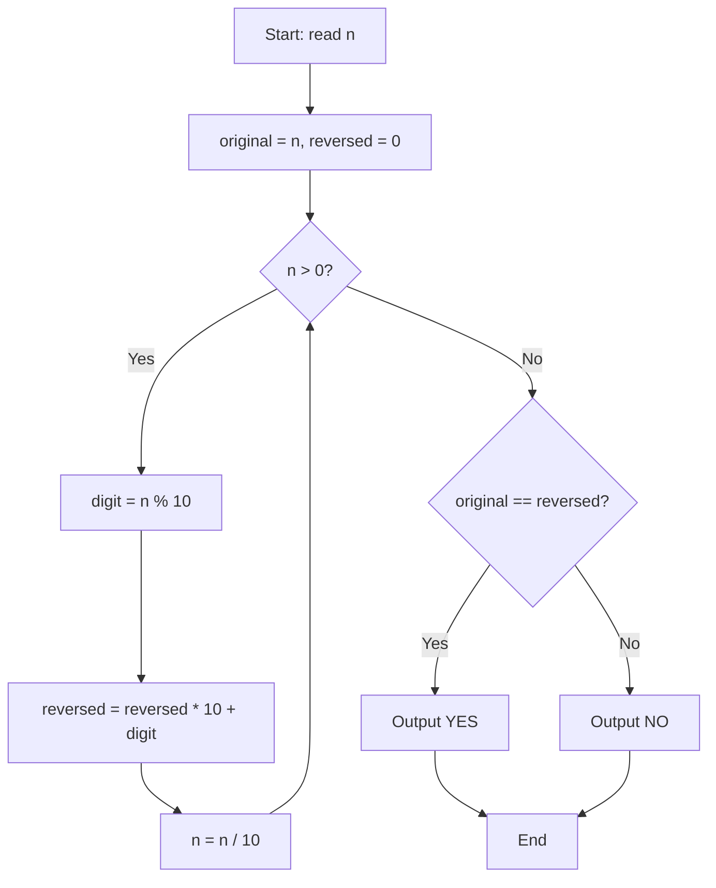
```mermaid
flowchart TD
    A["Start: read n"] --> B["original = n, reversed = 0"]
    B --> C{"n > 0?"}
    C -->|"Yes"| D["digit = n % 10"]
    D --> E["reversed = reversed * 10 + digit"]
    E --> F["n = n / 10"]
    F --> C
    C -->|"No"| G{"original == reversed?"}
    G -->|"Yes"| H["Output YES"]
    G -->|"No"| I["Output NO"]
    H --> J["End"]
    I --> J
```

---

### 5. Control Digit (Digital Root)

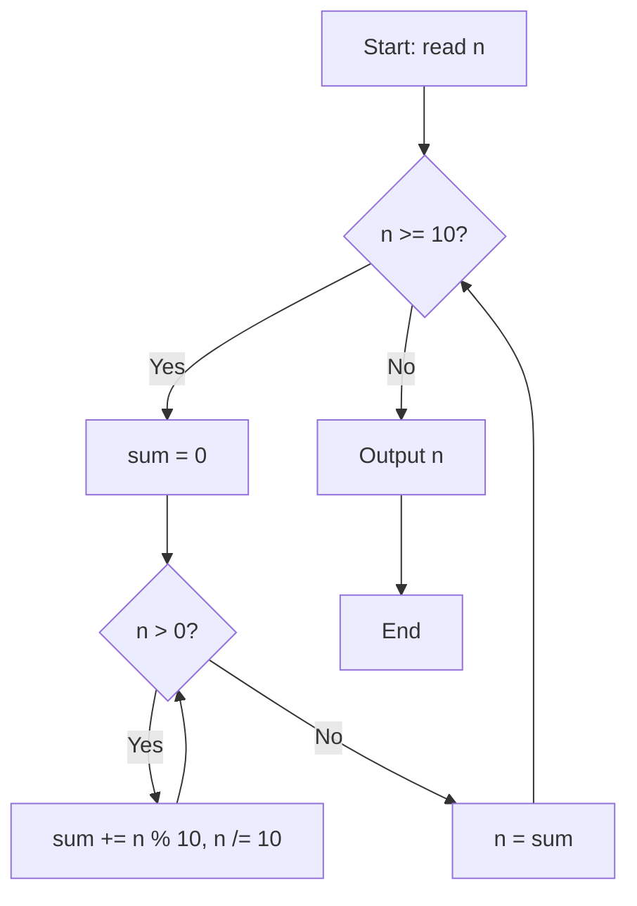
```mermaid
flowchart TD
    A["Start: read n"] --> B{"n >= 10?"}
    B -->|"Yes"| C["sum = 0"]
    C --> D{"n > 0?"}
    D -->|"Yes"| E["sum += n % 10, n /= 10"]
    E --> D
    D -->|"No"| F["n = sum"]
    F --> B
    B -->|"No"| G["Output n"]
    G --> H["End"]
```

---

### 6. Sum of Digits

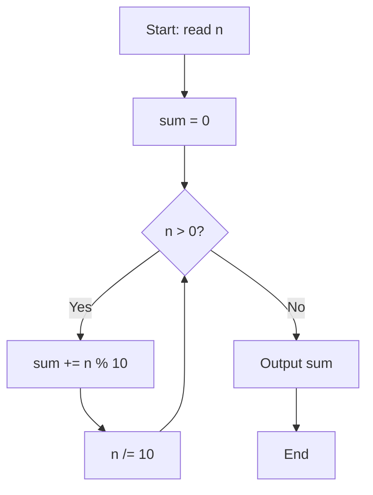
```mermaid
flowchart TD
    A["Start: read n"] --> B["sum = 0"]
    B --> C{"n > 0?"}
    C -->|"Yes"| D["sum += n % 10"]
    D --> E["n /= 10"]
    E --> C
    C -->|"No"| F["Output sum"]
    F --> G["End"]
```

---

### 7. Divisibility Check (generic)

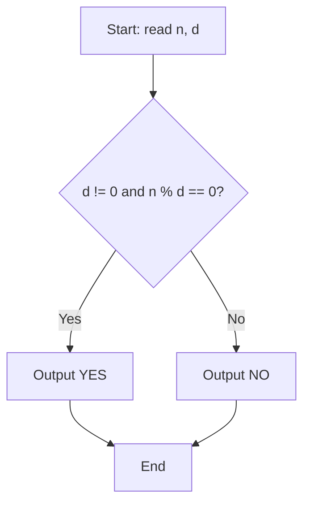
```mermaid
flowchart TD
    A["Start: read n, d"] --> B{"d != 0 and n % d == 0?"}
    B -->|"Yes"| C["Output YES"]
    B -->|"No"| D["Output NO"]
    C --> E["End"]
    D --> E
```

---

### 8. Prime Check (Optimized O(sqrt(n)))

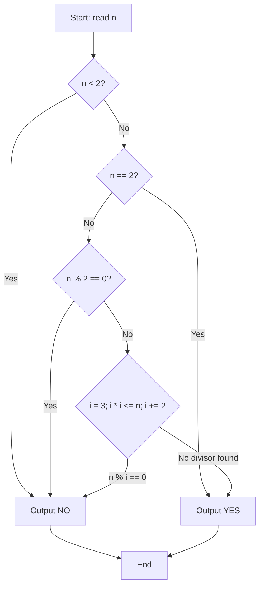
```mermaid
flowchart TD
    A["Start: read n"] --> B{"n < 2?"}
    B -->|"Yes"| C["Output NO"]
    B -->|"No"| D{"n == 2?"}
    D -->|"Yes"| E["Output YES"]
    D -->|"No"| F{"n % 2 == 0?"}
    F -->|"Yes"| C
    F -->|"No"| G{"i = 3; i * i <= n; i += 2"}
    G -->|"n % i == 0"| C
    G -->|"No divisor found"| E
    C --> H["End"]
    E --> H
```

---

### 9. Nth Fibonacci

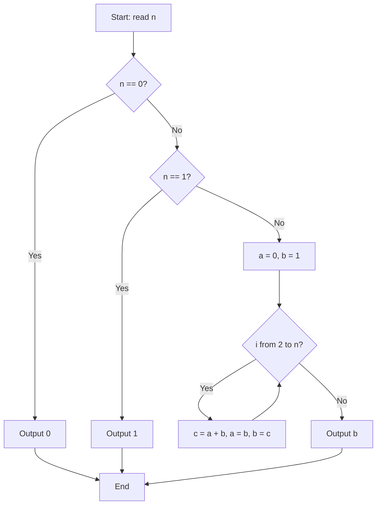
```mermaid
flowchart TD
    A["Start: read n"] --> B{"n == 0?"}
    B -->|"Yes"| C["Output 0"]
    B -->|"No"| D{"n == 1?"}
    D -->|"Yes"| E["Output 1"]
    D -->|"No"| F["a = 0, b = 1"]
    F --> G{"i from 2 to n?"}
    G -->|"Yes"| H["c = a + b, a = b, b = c"]
    H --> G
    G -->|"No"| I["Output b"]
    C --> J["End"]
    E --> J
    I --> J
```

---

### 10. GCD - Euclid's Algorithm

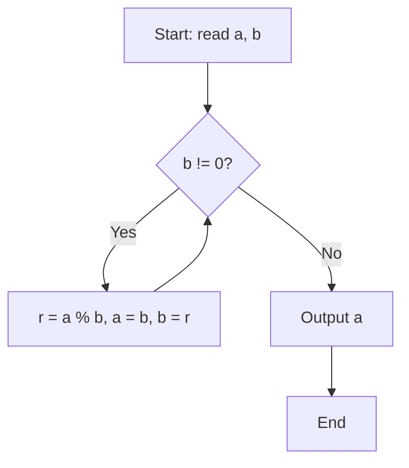
```mermaid
flowchart TD
    A["Start: read a, b"] --> B{"b != 0?"}
    B -->|"Yes"| C["r = a % b, a = b, b = r"]
    C --> B
    B -->|"No"| D["Output a"]
    D --> E["End"]
```

---

### 11. GCD - Subtraction Method

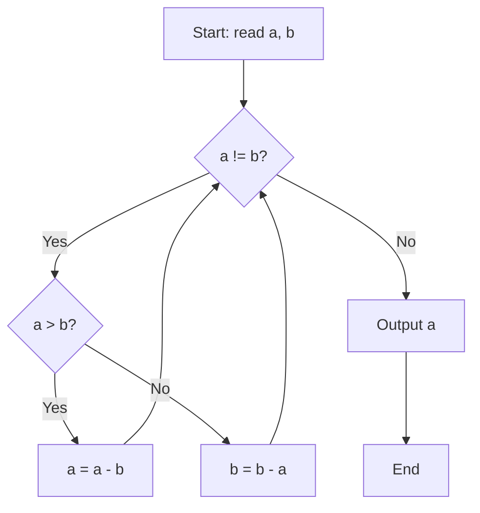
```mermaid
flowchart TD
    A["Start: read a, b"] --> B{"a != b?"}
    B -->|"Yes"| C{"a > b?"}
    C -->|"Yes"| D["a = a - b"]
    C -->|"No"| E["b = b - a"]
    D --> B
    E --> B
    B -->|"No"| F["Output a"]
    F --> G["End"]
```

---

### 12. LCM

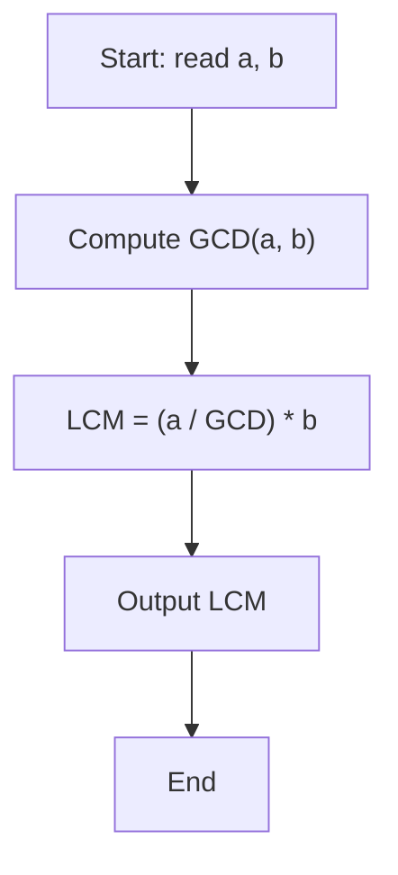
```mermaid
flowchart TD
    A["Start: read a, b"] --> B["Compute GCD(a, b)"]
    B --> C["LCM = (a / GCD) * b"]
    C --> D["Output LCM"]
    D --> E["End"]
```

---

### 13. Divisors - Efficient O(sqrt(n))

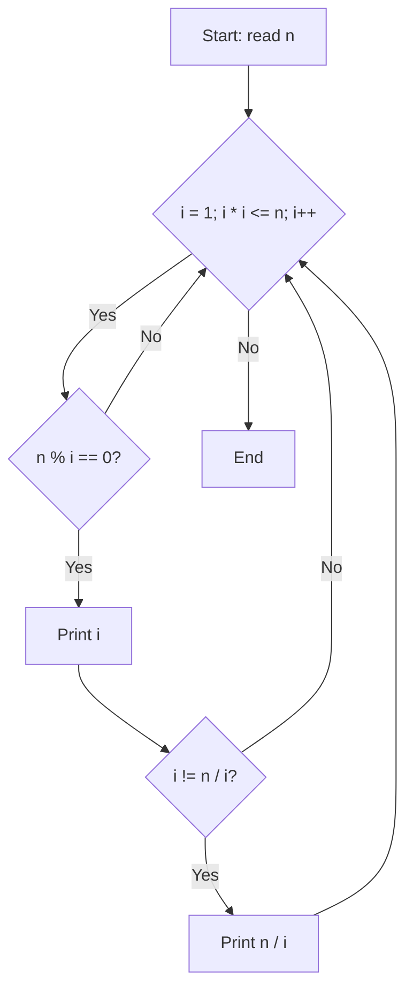
```mermaid
flowchart TD
    A["Start: read n"] --> B{"i = 1; i * i <= n; i++"}
    B -->|"Yes"| C{"n % i == 0?"}
    C -->|"Yes"| D["Print i"]
    D --> E{"i != n / i?"}
    E -->|"Yes"| F["Print n / i"]
    E -->|"No"| B
    F --> B
    C -->|"No"| B
    B -->|"No"| G["End"]
```

---

### 14. Prime Factorization

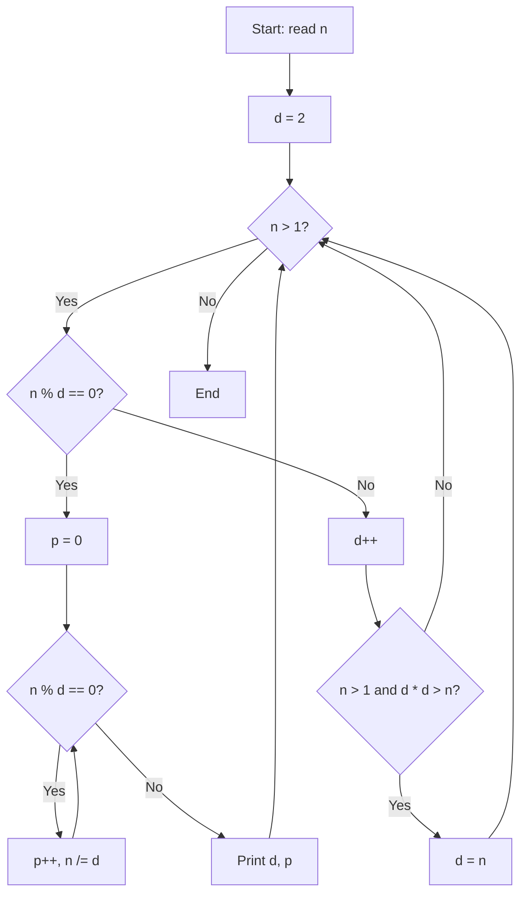
```mermaid
flowchart TD
    A["Start: read n"] --> B["d = 2"]
    B --> C{"n > 1?"}
    C -->|"Yes"| D{"n % d == 0?"}
    D -->|"Yes"| E["p = 0"]
    E --> F{"n % d == 0?"}
    F -->|"Yes"| G["p++, n /= d"]
    G --> F
    F -->|"No"| H["Print d, p"]
    D -->|"No"| I["d++"]
    I --> J{"n > 1 and d * d > n?"}
    J -->|"Yes"| K["d = n"]
    J -->|"No"| C
    H --> C
    K --> C
    C -->|"No"| L["End"]
```

---

### 15. Count / Filter Divisible Numbers

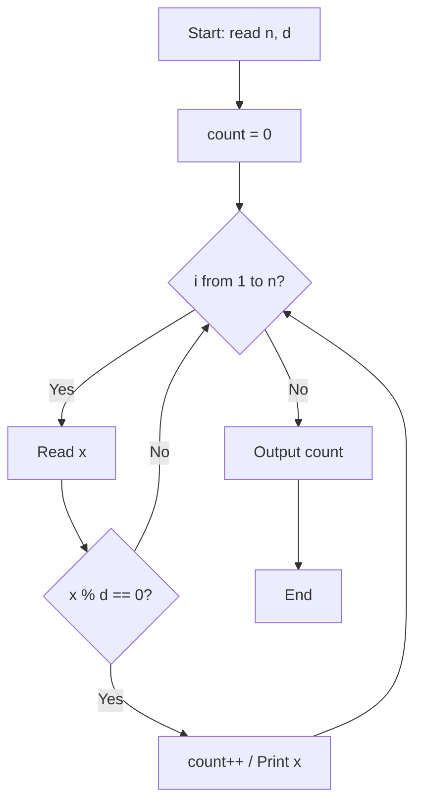
```mermaid
flowchart TD
    A["Start: read n, d"] --> B["count = 0"]
    B --> C{"i from 1 to n?"}
    C -->|"Yes"| D["Read x"]
    D --> E{"x % d == 0?"}
    E -->|"Yes"| F["count++ / Print x"]
    E -->|"No"| C
    F --> C
    C -->|"No"| G["Output count"]
    G --> H["End"]
```

---

### 16. For Loop

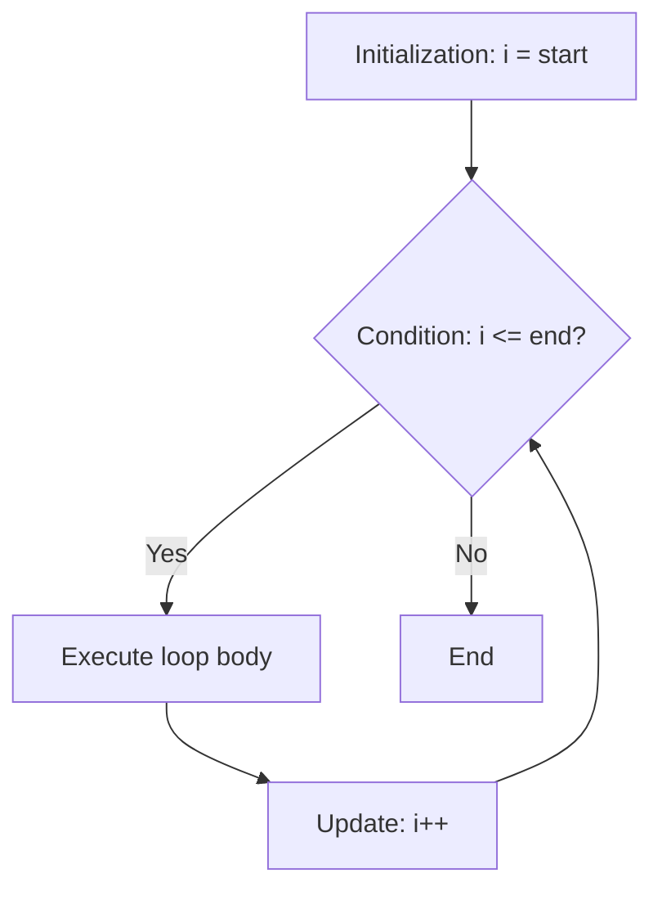
```mermaid
flowchart TD
    A["Initialization: i = start"] --> B{"Condition: i <= end?"}
    B -->|"Yes"| C["Execute loop body"]
    C --> D["Update: i++"]
    D --> B
    B -->|"No"| E["End"]
```

---

### 17. While Loop

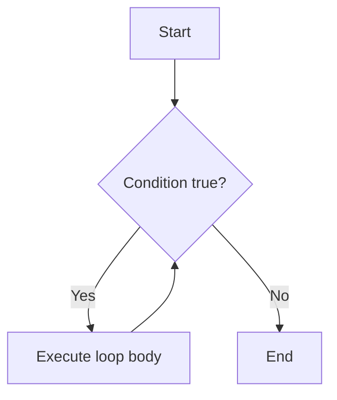
```mermaid
flowchart TD
    A["Start"] --> B{"Condition true?"}
    B -->|"Yes"| C["Execute loop body"]
    C --> B
    B -->|"No"| D["End"]
```

---

### 18. Do-While Loop

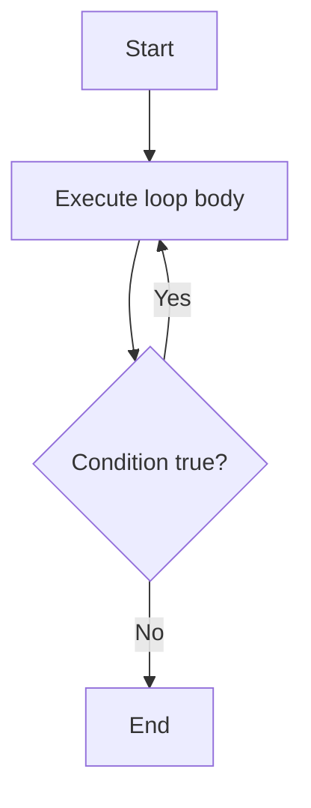
```mermaid
flowchart TD
    A["Start"] --> B["Execute loop body"]
    B --> C{"Condition true?"}
    C -->|"Yes"| B
    C -->|"No"| D["End"]
```

---

### 19. Break Statement

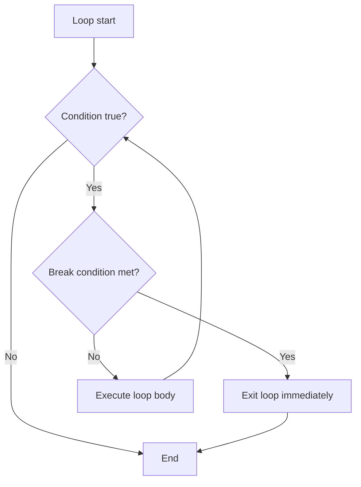
```mermaid
flowchart TD
    A["Loop start"] --> B{"Condition true?"}
    B -->|"Yes"| C{"Break condition met?"}
    C -->|"Yes"| D["Exit loop immediately"]
    C -->|"No"| E["Execute loop body"]
    E --> B
    B -->|"No"| F["End"]
    D --> F
```

---

### 20. Continue Statement

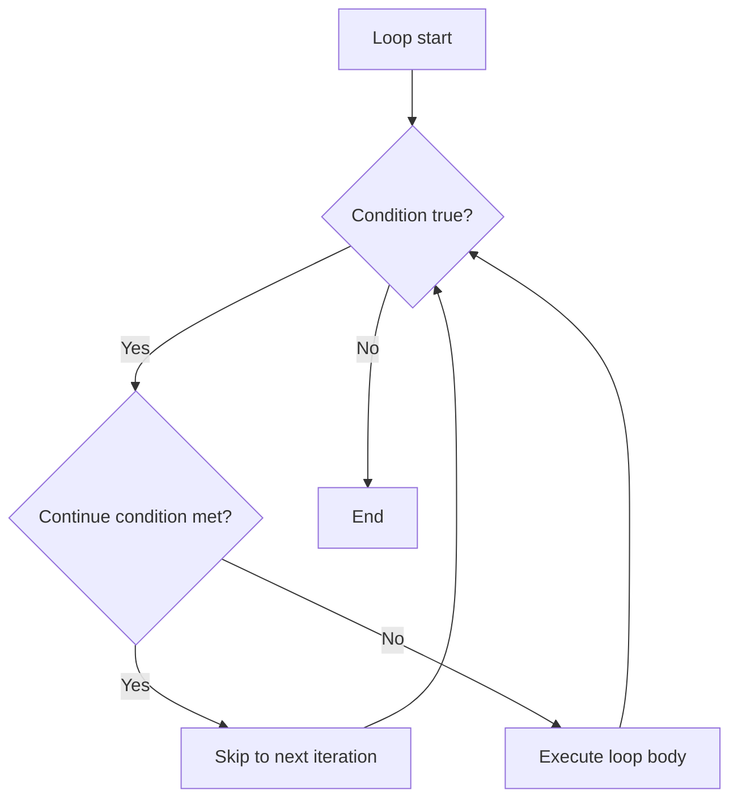
```mermaid
flowchart TD
    A["Loop start"] --> B{"Condition true?"}
    B -->|"Yes"| C{"Continue condition met?"}
    C -->|"Yes"| D["Skip to next iteration"]
    C -->|"No"| E["Execute loop body"]
    E --> B
    B -->|"No"| F["End"]
    D --> B
```

---

### 21. If / Else Structure

```mermaid
flowchart TD
    A["Start"] --> B{"Condition?"}
    B -->|"True"| C["Execute IF block"]
    B -->|"False"| D{"Else condition?"}
    D -->|"True"| E["Execute ELSE IF block"]
    D -->|"False"| F["Execute ELSE block"]
    C --> G["End"]
    E --> G
    F --> G
```

---

### 22. Recursive Digit Processing (generic)

```mermaid
flowchart TD
    A["Start: read n"] --> B{"Base case?<br/>n < 10 or n == 0"}
    B -->|"Yes"| C["Return / handle last digit"]
    B -->|"No"| D["Process n % 10<br/>(current digit)"]
    D --> E["Recurse with n / 10<br/>(remaining digits)"]
    E --> F["Combine result"]
    C --> F
    F --> G["End"]
```

---

### 23. Flood Fill (Algoritm de umplere)

```mermaid
flowchart TD
    A["Start: read matrix, start cell, new color"] --> B["target = matrix[start]"]
    B --> C{"target == new color?"}
    C -->|"Yes"| Z["End"]
    C -->|"No"| D["Call floodFill(start)"]
    D --> E{"Cell in bounds and<br/>color == target?"}
    E -->|"No"| F["Return"]
    E -->|"Yes"| G["matrix[r][c] = new color"]
    G --> H["floodFill up"]
    H --> I["floodFill down"]
    I --> J["floodFill left"]
    J --> K["floodFill right"]
    K --> L["Print filled matrix"]
    L --> Z
    F --> Z
```

---

### 24. Merge Sort (Sortare prin interclasare)

```mermaid
flowchart TD
    A["Start: mergeSort(left, right)"] --> B{"left >= right?"}
    B -->|"Yes"| Z["End (single element)"]
    B -->|"No"| C["mid = (left + right) / 2"]
    C --> D["mergeSort(left, mid)"]
    D --> E["mergeSort(mid + 1, right)"]
    E --> F["merge(left, mid, right)"]
    F --> Z
```

---

### 25. Quick Sort (Sortare rapida)

```mermaid
flowchart TD
    A["Start: quickSort(left, right)"] --> B{"left >= right?"}
    B -->|"Yes"| Z["End (single element)"]
    B -->|"No"| C["p = partition(left, right)"]
    C --> D["quickSort(left, p - 1)"]
    D --> E["quickSort(p + 1, right)"]
    E --> Z
```

---

### 26. C++ Strings (Siruri de caractere)

```mermaid
flowchart TD
    A["Start: declare string s"] --> B["Read / build the string"]
    B --> C["length = s.length()"]
    C --> D["Iterate characters: for char c in s"]
    D --> E["Apply operations:<br/>concat / access / compare / substr"]
    E --> F["Output result"]
    F --> G["End"]
```

---

### 27. Escape Sequences (Secvente escape)

```mermaid
flowchart TD
    A["Start"] --> B["\\n newline, \\t tab"]
    B --> C["\\\\ backslash, \\\" quote"]
    C --> D["\\x41 / \\101 hex / octal"]
    D --> E["\\0 null terminator"]
    E --> F["Output with escapes interpreted"]
    F --> G["End"]
```

---

### 28. Heterogeneous Data Structures

```mermaid
flowchart TD
    A["Start: define a struct / union"] --> B["Declare fields of different types"]
    B --> C["Create instances"]
    C --> D{"struct or union?"}
    D -->|"struct"| E["Access members simultaneously"]
    D -->|"union"| F["Access one member at a time"]
    E --> G["Use single values or arrays of structs"]
    F --> G
    G --> H["End"]
```

---

### 29. Stack (Stiva)

```mermaid
flowchart TD
    A["Start: declare stack"] --> B["push(x) -> add to top"]
    B --> C["top() -> inspect top element"]
    C --> D{"need to remove?"}
    D -->|"Yes"| E["pop() -> remove top"]
    D -->|"No"| F{"continue?"}
    E --> F
    F -->|"Yes"| C
    F -->|"No"| G["empty()? check if stack is empty"]
    G --> H["End"]
```

---

### 30. Queue (Coada)

```mermaid
flowchart TD
    A["Start: declare queue"] --> B["enqueue(x) -> add to rear"]
    B --> C["front() -> inspect front element"]
    C --> D{"need to remove?"}
    D -->|"Yes"| E["dequeue() -> remove front"]
    D -->|"No"| F{"continue?"}
    E --> F
    F -->|"Yes"| C
    F -->|"No"| G["empty()? check if queue is empty"]
    G --> H["End"]
```

---

### 31. Singly Linked List (Lista simplu inlantuie)

```mermaid
flowchart TD
    A["Start"] --> B["Create new node"]
    B --> C{"Insert position?"}
    C -->|"Front"| D["new->next = head; head = new"]
    C -->|"End"| E["walk to last node; last->next = new"]
    E --> F["Delete by value: find node, relink, delete"]
    D --> F
    F --> G{"Display list"]
    G --> H["End"]
```

---

### 32. Doubly Linked List (Lista dublu inlantuie)

```mermaid
flowchart TD
    A["Start"] --> B["Create new node with prev and next"]
    B --> C{"Insert position?"}
    C -->|"Front"| D["new->next = head; head->prev = new; head = new"]
    C -->|"End"| E["new->prev = tail; tail->next = new; tail = new"]
    E --> F["Delete by value: update prev/next of neighbors, delete"]
    D --> F
    F --> G{"Display forward"]
    G --> H{"Display backward"]
    H --> I["End"]
```

---

### 33. Combinatorics

```mermaid
flowchart TD
    A["Start: read n, k"] --> B{"k > n?"}
    B -->|"Yes"| Z["Result = 0"]
    B -->|"No"| C["Compute n!, k!, (n-k)!"]
    C --> D{"Operation?"}
    D -->|"Permutations"| E["P = n! / (n-k)!"]
    D -->|"Combinations"| F["C = n! / (k! * (n-k)!)"]
    E --> G["Output result"]
    F --> G
    G --> Z
```

---

### 34. Algorithm Complexity

```mermaid
flowchart TD
    A["Start: analyze algorithm"] --> B{"Nested loops?"}
    B -->|"Yes"| C["O(n^2) or worse"]
    B -->|"No"| D{"Single loop?"}
    D -->|"Yes"| E["O(n)"]
    D -->|"No"| F{"Divide and conquer?"}
    F -->|"Yes"| G["O(n log n)"]
    F -->|"No"| H{"Binary search style?"}
    H -->|"Yes"| I["O(log n)"]
    H -->|"No"| J["O(1) constant"]
    C --> K["Output complexity class"]
    E --> K
    G --> K
    I --> K
    J --> K
    K --> L["End"]
```

---

### 35. Geometry Basics

```mermaid
flowchart TD
    A["Start: read input"] --> B{"Shape?"}
    B -->|"Points"| C["Distance: sqrt(dx^2 + dy^2)"]
    B -->|"Rectangle"| D["Area = w*h; Perimeter = 2*(w+h)"]
    B -->|"Circle"| E["Area = pi*r^2; Perimeter = 2*pi*r"]
    B -->|"Triangle"| F["Heron: s = (a+b+c)/2; Area = sqrt(s(s-a)(s-b)(s-c))"]
    C --> G["Output result"]
    D --> G
    E --> G
    F --> G
    G --> H["End"]
```

---

### 36. Miscellaneous Problems

```mermaid
flowchart TD
    A["Start: read problem input"] --> B{"Problem type?"}
    B -->|"String"| C["Count vowels or analyze characters"]
    B -->|"Matrix"| D["Find max or search for value"]
    B -->|"Array"| E["Rotate, reverse, or filter"]
    C --> F["Output result"]
    D --> F
    E --> F
    F --> G["End"]
```

---

### 37. Backtracking (Subsets / Permutations / Combinations)

```mermaid
flowchart TD
    A["Start: backtrack(index)"] --> B{"Base case reached?"}
    B -->|"Yes"| C["Output current solution"]
    B -->|"No"| D["Try each candidate from start to n"]
    D --> E["Choose candidate -> add to current"]
    E --> F["Recurse: backtrack(index + 1)"]
    F --> G["Backtrack: remove candidate"]
    G --> D
    D --> H["End"]
    C --> H
```

---

### 38. Backtracking in Plan (Grid Paths)

```mermaid
flowchart TD
    A["Start at (0,0)"] --> B{"Mark current cell as visited"}
    B --> C{"At destination?"}
    C -->|"Yes"| D["Record path"]
    C -->|"No"| E{"Can move right?"}
    E -->|"Yes"| F["Move right -> recurse"]
    E -->|"No"| G{"Can move down?"}
    G -->|"Yes"| H["Move down -> recurse"]
    G -->|"No"| I["Backtrack: unmark current"]
    F --> I
    H --> I
    D --> I
    I --> J["End"]
```

---

### 39. N-Queens (Backtracking - Diverse Problems)

```mermaid
flowchart TD
    A["Start: place queen in col 0"] --> B{"Col == n?"}
    B -->|"Yes"| C["Record solution"]
    B -->|"No"| D["Try each row in current col"]
    D --> E{"Safe to place?"}
    E -->|"Yes"| F["Place queen -> recurse col+1"]
    E -->|"No"| D
    F --> G["Backtrack: remove queen"]
    G --> D
    C --> H["End"]
    D --> H
```

---

### 40. Greedy Method (Generic)

```mermaid
flowchart TD
    A["Start: prepare candidates"] --> B["Sort by some greedy rule"]
    B --> C["Initialize solution"]
    C --> D{"More candidates?"}
    D -->|"Yes"| E["Pick best local candidate"]
    E --> F["Add to solution"]
    F --> D
    D -->|"No"| G["Output solution"]
    G --> H["End"]
```

---

## 🎯 Goals

* Build a strong foundation in algorithms
* Prepare for contests (e.g. competitive programming)
* Improve problem-solving skills
* Create a solid GitHub portfolio

---

## 🤝 Contributing

Contributions are welcome!

1. Fork the repository
2. Create a new branch (`feature-new-algo`)
3. Commit your changes
4. Open a Pull Request

---

## 📜 License

This project is licensed under the **MIT License**.

---

## 👨‍💻 Author

**Aurel Ionita**

* GitHub: https://github.com/itsiamdev

---

## ⭐ Support

If you find this repository useful, consider giving it a **star ⭐**!
